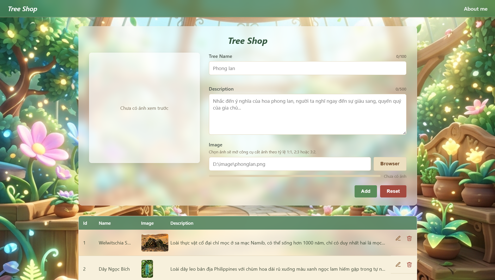
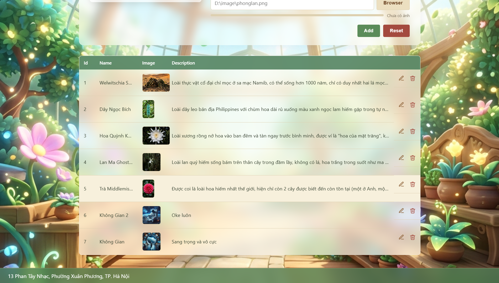
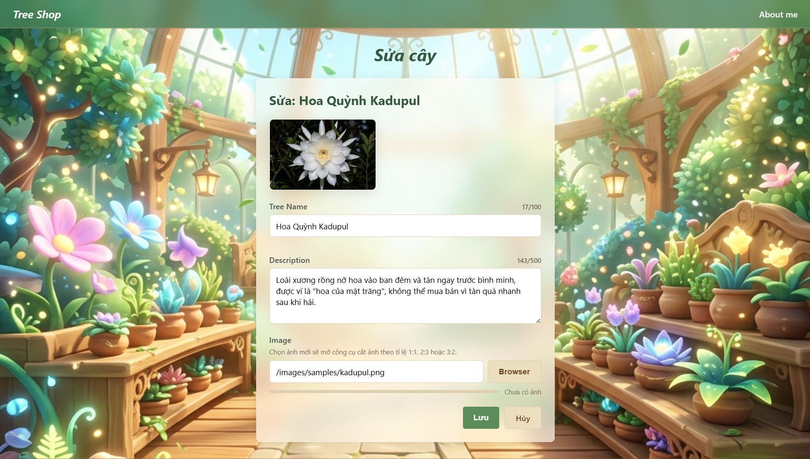
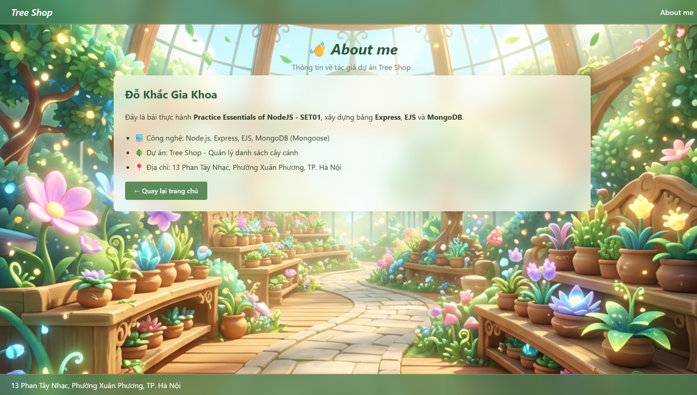

# T2508M_SEM2_Test
Nơi nộp bài lớp T2508M học kỳ 2

## Tree Shop — Tài liệu đặc tả sản phẩm

Ứng dụng quản lý danh sách cây cảnh (CRUD), xây dựng bằng **Express**, **EJS**, **MongoDB** (Mongoose). Đề bài gốc xem [REQUIREMENTS.md](./REQUIREMENTS.md); kế hoạch triển khai xem [PLAN.md](./PLAN.md); báo cáo đối chiếu thang điểm xem [REPORT.md](./REPORT.md); đặc tả UI/UX xem [interface-description.md](./interface-description.md).

---

## 1. Tổng quan

Tree Shop cho phép người dùng:

- Thêm mới cây (kèm ảnh, có công cụ **crop ảnh** theo tỉ lệ 1:1 / 2:3 / 3:2 ngay trên trình duyệt).
- Xem toàn bộ danh sách cây dạng bảng.
- Sửa / xóa từng cây.
- Xóa toàn bộ dữ liệu (Reset).
- Validate dữ liệu: bắt buộc Tree Name & Description, giới hạn độ dài, giới hạn dung lượng ảnh, **chặn trùng tên** (kiểm tra ngay khi rời khỏi ô nhập, không cần đợi submit).
- Trang giới thiệu tác giả (About me).

## 2. Giao diện thực tế (Screenshots)

| Thêm dữ liệu (Add) | Danh sách cây (List) |
|---|---|
|  |  |

| Sửa cây (Edit) | About me |
|---|---|
|  |  |

## 3. Công nghệ sử dụng

| Thành phần | Công nghệ |
|---|---|
| Backend | Node.js, Express.js |
| Template engine | EJS |
| Database | MongoDB (Mongoose ODM) |
| Style | CSS thuần, hiệu ứng glassmorphism (liquid glass) |
| Ảnh | Crop ảnh client-side bằng `<canvas>`, lưu dạng data URL trong MongoDB (không upload file lên server) |

## 4. Yêu cầu môi trường

- Node.js (khuyến nghị v18+)
- MongoDB chạy local tại `mongodb://127.0.0.1:27017` (mặc định `mongod` không cần cấu hình gì thêm, hoặc chỉnh `MONGO_URI` trong `.env`)

## 5. Cài đặt & chạy

```bash
npm install
npm start
```

Sau đó truy cập: http://localhost:3000

Ứng dụng tự kết nối tới database `TreeShop`, collection `TreeCollection` (tự tạo khi thêm cây đầu tiên).

> **Auto-seed dữ liệu mẫu**: nếu `TreeCollection` đang rỗng (ví dụ vừa clone repo về, chưa từng chạy app), server sẽ tự động thêm sẵn 5 cây/hoa hiếm mẫu (xem [`seed/plantSeed.js`](./seed/plantSeed.js), ảnh tại `public/images/samples/`) ngay khi khởi động — không cần thao tác thêm. Nếu collection đã có dữ liệu, cơ chế này sẽ bỏ qua, không ghi đè.

## 6. Cấu trúc dự án

```
app.js                          # Entry point: Express, EJS, kết nối MongoDB, error-handling middleware
models/
  Tree.js                       # Mongoose schema
routes/
  treeRoutes.js                 # Toàn bộ route + validate (required, độ dài, dung lượng ảnh, trùng tên)
seed/
  plantSeed.js                  # Dữ liệu 5 cây mẫu, tự động thêm khi database rỗng
views/
  index.ejs                     # Trang chủ: include form thêm cây + bảng danh sách
  edit.ejs                      # Trang sửa cây
  about.ejs                     # Trang giới thiệu
  partials/
    header.ejs                  # Header dùng chung
    footer.ejs                  # Footer dùng chung
    add-tree-form.ejs           # Component "Form Card": tiêu đề + preview ảnh + form thêm cây (glassmorphism)
    crop-modal.ejs               # Modal công cụ crop ảnh (dùng chung cho trang thêm & sửa)
public/
  css/style.css                 # Toàn bộ style: theme màu gỗ + xanh lá, hiệu ứng kính mờ
  js/
    image-crop.js                # Logic chọn ảnh, crop theo tỉ lệ, đo & giới hạn dung lượng
    char-counter.js              # Bộ đếm ký tự Tree Name/Description
    name-check.js                # Kiểm tra trùng tên real-time (gọi API khi blur/gõ)
  images/
    background.png               # Ảnh nền trang (xem prompt tạo ảnh tại BACKGROUND.md)
    samples/                      # 5 ảnh cây/hoa hiếm dùng làm dữ liệu mẫu (xem PLANT_IMAGES.md)
.env                             # MONGO_URI, PORT
```

## 7. Database

- Database: `TreeShop`
- Collection: `TreeCollection`
- Schema (`models/Tree.js`):

| Field | Kiểu | Bắt buộc | Ghi chú |
|---|---|---|---|
| `treename` | String | ✅ | tối đa 100 ký tự, không trùng (không phân biệt hoa/thường) |
| `description` | String | ✅ | tối đa 500 ký tự |
| `image` | String | ❌ | đường dẫn thủ công, hoặc data URL ảnh đã crop |
| `imageRatio` | String | ❌ | `1:1` / `2:3` / `3:2`, dùng để hiển thị đúng tỉ lệ ảnh đã crop |

## 8. Danh sách route

| Route | Method | Chức năng |
|---|---|---|
| `/` | GET | Hiển thị danh sách toàn bộ cây |
| `/add` | POST | Thêm cây mới (validate required, độ dài, dung lượng ảnh, trùng tên) |
| `/edit/:id` | GET | Hiển thị form sửa cây |
| `/edit/:id` | POST | Cập nhật cây (cùng bộ validate như `/add`, loại trừ chính bản ghi khi check trùng tên) |
| `/delete/:id` | POST | Xóa một cây |
| `/reset` | POST | Xóa toàn bộ dữ liệu |
| `/about` | GET | Trang giới thiệu |
| `/api/check-name` | GET | API kiểm tra trùng tên real-time, query `name`, `excludeId` (dùng ở trang Sửa) |

`:id` không hợp lệ (không đúng định dạng ObjectId) sẽ tự động redirect về `/` thay vì làm crash server.

## 9. Tính năng nổi bật

- **Crop ảnh khi thêm/sửa cây**: chọn file → mở modal → chọn tỉ lệ 1:1/2:3/3:2 → kéo để dịch chuyển, zoom để chỉnh vùng cắt → xuất ảnh qua `<canvas>` thành data URL.
- **Giới hạn & đo dung lượng ảnh**: chặn chọn ảnh gốc > 10MB, hiển thị thanh đo dung lượng ảnh gốc (trong modal) và ảnh sau khi crop (trong form), validate lại dung lượng phía server.
- **Giới hạn ký tự + bộ đếm**: Tree Name tối đa 100 ký tự, Description tối đa 500 ký tự, hiển thị bộ đếm `x/100`, `x/500` real-time.
- **Chặn trùng tên**: không phân biệt hoa/thường, báo ngay khi rời khỏi ô nhập (blur) qua API `/api/check-name`, và validate lại phía server khi submit.
- **Giao diện**: theme màu gỗ + xanh lá, hiệu ứng liquid glass (kính mờ bán trong suốt, `backdrop-filter`) cho header/footer/card/bảng/modal, ảnh nền 3D phong cách fantasy (xem [BACKGROUND.md](./BACKGROUND.md)).
- **Bảng danh sách**: cột Name/Description tự động rút gọn bằng dấu "..." khi quá dài (hover để xem đầy đủ), cột Id/Name/Image thu hẹp, cột Description chiếm phần rộng còn lại.

## 10. Dữ liệu mẫu

5 cây/hoa hiếm được **tự động thêm vào database khi collection rỗng** (xem mục 5 — Auto-seed), ảnh đặt tại `public/images/samples/` (đã commit lên Git, không bị `.gitignore` loại trừ), prompt tạo ảnh và mô tả chi tiết xem [PLANT_IMAGES.md](./PLANT_IMAGES.md):

1. Trà Middlemist's Red
2. Lan Ma Ghost Orchid
3. Hoa Quỳnh Kadupul
4. Dây Ngọc Bích (Jade Vine)
5. Welwitschia Sa Mạc

## 11. Giới hạn / Ghi chú

- Trường **Image** lưu dưới dạng đường dẫn text (nếu gõ tay) hoặc data URL ảnh đã crop (nếu chọn file qua công cụ cắt ảnh) — không upload file thật lên ổ đĩa server, ảnh crop được nhúng trực tiếp trong document MongoDB.
- Chưa có xác thực người dùng (không có đăng nhập/phân quyền) — phù hợp phạm vi bài thực hành.
